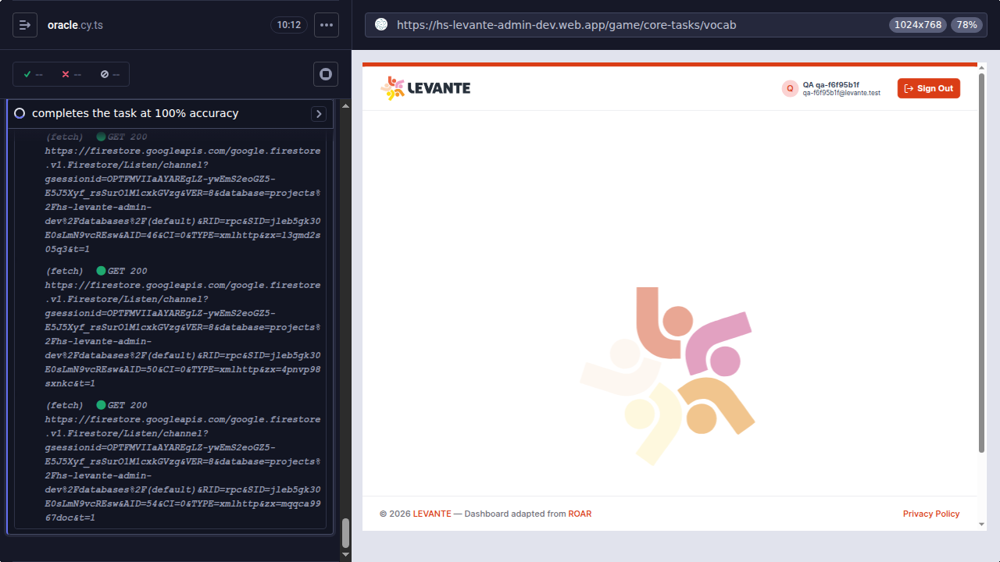

# Vocab (en-US) intermittent slow-boot timeout on `-dev`

- **Status:** Open — needs core-tasks/perf triage
- **First flagged:** 2026-06-26 (daily oracle sweep)
- **Environment:** `hs-levante-admin-dev.web.app` / `levante-assets-dev`
- **Task:** `vocab` (Picture Vocabulary, 4-AFC) · agent: oracle
- **Severity:** Medium — blocks the vocab cell in the daily sweep; not a data-correctness bug

## Summary

The vocab task on `-dev` **intermittently fails to launch**: it loads
`/game/core-tasks/vocab`, signs the participant in, opens Firestore listeners —
and then **stalls on the LEVANTE splash screen indefinitely**; the vocab task
component never mounts. When it *does* mount, it completes correctly at 100%
oracle accuracy. So this is an **intermittent app-side boot stall**, not a
content defect. On 2026-06-26, 4 of 6 en-US vocab runs stalled; the other 2
booted and passed (7.5–8 min end-to-end).

> **Timeout mitigation tested and rejected.** The boot gate was raised from
> 300 s → 600 s and re-run: the task stalled the **full 10 minutes** and still
> failed (`Timed out after 600000ms… 'OK' but never did`, 629 s wall). So when
> it fails it is a *hard* stall, not marginal latency we can wait out — a bigger
> timeout only doubles wasted sweep time. The gate has been reverted to 300 s.

### What the stall looks like



URL is `/game/core-tasks/vocab`, the participant is signed in (see `qa-f6f95b1f`
top-right), and the Cypress command log shows healthy repeating Firestore
`Listen/channel` `GET 200`s — i.e. the page is alive and talking to Firestore,
but the task never initializes off the splash.

## Symptom

The oracle spec waits for the first "OK" continue button after launch
(`BOOT_TIMEOUT_MS`, currently 300 s). When the app never surfaces that button,
the run fails with:

```
AssertionError: Timed out retrying after 300000ms: Expected to find content: 'OK' but never did.
```

(With the gate temporarily at 600 s the message read `600000ms` — same stall.)

## Evidence

All runs below are `cypress/e2e/vocab/oracle.cy.ts` launched via the dashboard
(provision participant → log in → launch vocab). Duration = full spec runtime
for passing runs.

| Date (PT) | Run ID | Lang | Result | Duration |
|---|---|---|---|---|
| 2026-06-26 11:14 | `dc23dd90` | en-US | **FAIL** (OK timeout) | — |
| 2026-06-26 11:24 | `d8386437` | en-US | pass | 480 s |
| 2026-06-26 11:37 | `d30d1692` | en-US | pass | 450 s |
| 2026-06-26 11:56 | `e61f60a1` | en-US | **FAIL** (OK timeout) | — |
| 2026-06-26 12:31 | `18f6e103` | en-US | **FAIL** (OK timeout) | — |
| 2026-06-26 13:01 | `63662cac` | en-US | **FAIL** (OK timeout) | — |
| 2026-06-26 15:33 | `f6f95b1f` | en-US | **FAIL** (stall, 600 s gate) | — |
| 2026-06-02 21:41 | `5a917871` | en-US | pass | 364 s |
| 2026-06-03 07:16 | `59472db3` | en-US | pass | 243 s |
| 2026-06-01 (×13) | various | en-US | pass | 232–499 s |
| 2026-06-02 | `120af0a1` / `abbc755e` | de-DE | pass | 461 s / 530 s |
| 2026-06-02 | `6bc1b4aa` | es-CO | pass | 212 s |

**Reads:**

- Healthy vocab runs already cluster **232–530 s end-to-end** — vocab is the
  slowest core task (heavy per-item image + audio preload). The 300 s *boot*
  gate has little headroom when `-dev` is under load.
- It is **not en-US-exclusive**: de-DE and es-CO vocab are equally slow and have
  also failed occasionally. en-US just runs most often in the sweep, so it shows
  the flakiness most.
- The June 1–3 history was all-green, so today's 4/6 failure rate suggests a
  `-dev` slowdown stacked on top of an already-tight timeout.

## Reproduce manually

A dashboard run provisions a single-task participant on `hs-levante-admin-dev`.
Accounts from today's **failing** runs still hold an open vocab/en-US
assignment (password is per-account):

| Email | Password |
|---|---|
| `qa-63662cac@levante.test` | `Qa-ZBt1AknJi7LzbLX1` |
| `qa-18f6e103@levante.test` | `Qa-uf23cGqxLflwipny` |
| `qa-dc23dd90@levante.test` | `Qa-GR52UKcV-6Ad-yR8` |

Steps: open `https://hs-levante-admin-dev.web.app`, sign in as the participant,
start the assigned **Vocabulary** task, and time how long it takes to reach the
first instruction screen (watch the network tab for the image/audio preload).

Or mint a fresh participant + assignment on demand:

```bash
node scripts/e2e-init/provision-participant.mjs \
  --task vocab --language en-US --age-years 8 --age-months 0
# prints PROVISION_RESULT={"email","password","uid"}
```

## Likely cause & next steps

The 600 s test rules out "just slow." When it fails, vocab is **stuck on the
splash with the task never mounting**, despite an authenticated session and live
Firestore traffic — an **app-side initialization stall** specific to the vocab
core-task launch, reproducible intermittently on `-dev`.

- **For the core-tasks team (root cause):** investigate what gates the vocab
  task mount at `/game/core-tasks/vocab`. The page is signed in and Firestore
  `Listen` channels are active, so it's likely waiting on a promise/subscription
  that never resolves (e.g. assignment/variant doc, or the task bundle/asset
  manifest) on some fraction of launches. Compare a stalled boot vs. a healthy
  one in the Network/console (the stalled session just repeats Firestore
  `Listen/channel` GETs with no task-bundle fetch).
- **Harness:** no change helps. The 300 s gate is fine for healthy boots and a
  longer gate only wastes sweep time on stalls (reverted to 300 s). Optionally
  add a fail-fast that detects "still on splash after N s" to abort sooner and
  capture the diagnostic screenshot automatically.

## Reproduced manually / from logs

Live run `f6f95b1f` (2026-06-26 15:33 PT) stalled 10 min at 600 s; screenshot
above is from that run.

## Related

- Daily sweep report: `results/daily/2026-06-26.md`
- Same `'OK'`-timeout signature appeared for the `nl` vocab cell, but that is
  gated earlier by the separate Dutch-audio-in-`-dev` gap (see the nl-NL audio
  promotion issue), so it is not additional evidence here.
